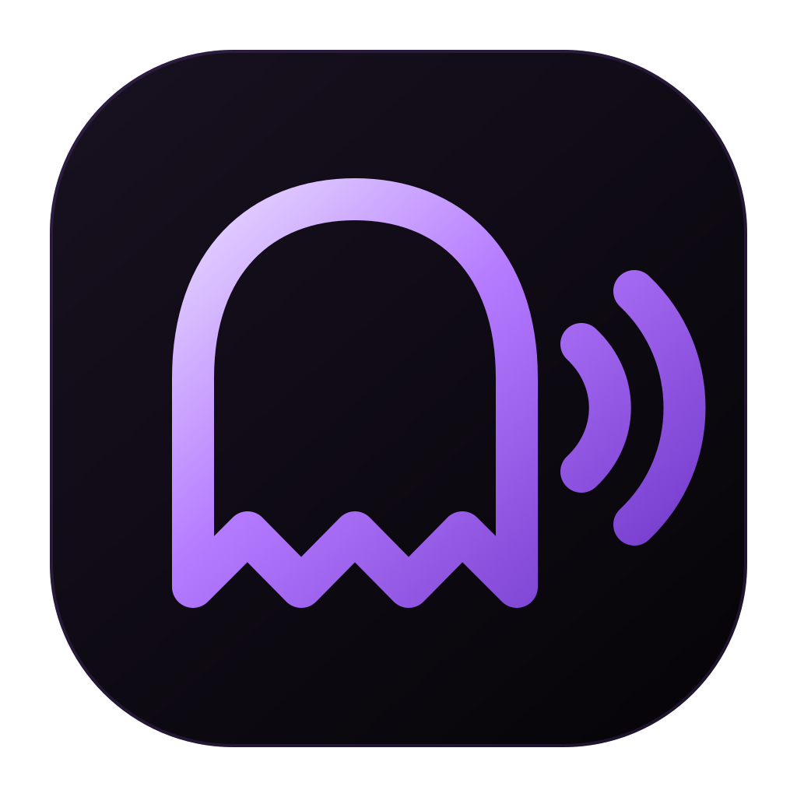

<div align="center">
  
  <h1>Silhouette</h1>
  <p><strong>Private sharing and real-time P2P communication.</strong><br />私密分享与实时点对点通信。</p>
  <p><a href="https://chat.silh0uette.space">Web App</a> · <a href="https://blog.maszr.xyz">Author's Blog / 作者博客</a> · <a href="LICENSE">MIT License</a></p>
</div>

---

## 中文

### 项目简介

Silhouette 是一个以隐私为核心的通信项目，提供阅后即焚消息、加密链接和基于 WebRTC 的实时 P2P 聊天。仓库当前主要包含使用 Flutter 开发的原生 Windows 客户端，不使用 Electron，也不把网站嵌入 WebView。

生产网站：[chat.silh0uette.space](https://chat.silh0uette.space)
作者博客：[blog.maszr.xyz](https://blog.maszr.xyz)

### 当前功能

**网页版**

- 在浏览器中加密一次性消息和 URL，解密密钥保留在链接片段中。
- 支持 Text、Markdown、JSON、XML、助记词和钱包地址等内容格式。
- 支持有效期、查看次数、允许 IP 和延迟开放等限制。
- 小型多人 WebRTC Mesh 聊天室。
- P2P 文字消息、10 MB 以内附件、送达与已读回执。
- 聊天室历史入口、自定义本地房间名称、剩余时间和链接分享。
- 邮箱密码、邮箱验证码和 Google 登录。
- 深色/浅色主题、中英文界面和响应式移动端布局。

**Windows 客户端（开发中）**

- 原生 Flutter Windows 界面。
- 邮箱密码注册与登录、邮箱验证码和浏览器 Google 授权。
- Windows 安全凭据存储中的会话令牌。
- 登录状态恢复、明暗主题和桌面聊天应用框架。
- 聊天、私密消息和链接功能将逐步从网页版迁移。

### 工作原理

```text
Windows / Browser client
  ├─ HTTPS API: 账户、验证码、一次性加密载荷
  ├─ WebSocket: 只交换 WebRTC 信令和房间成员状态
  ├─ STUN: 发现可用于直连的网络地址
  └─ WebRTC DataChannel: 聊天消息、回执和附件
```

聊天室采用小规模 Mesh 拓扑。每个参与者分别与房间中的其他参与者建立 WebRTC DataChannel，发送者直接向每个对等端发送一次消息，接收者不会继续转发。每条消息使用唯一 ID 去重，并按接收者记录送达和已读状态。

当前只配置 STUN，不配置 TURN。信令服务器会看到连接所需的房间和网络元数据，但在成功直连时不会承载聊天正文或附件。严格的纯 P2P 设计也意味着某些 NAT、防火墙或企业网络环境下可能无法建立连接，而不会降级为服务器中继。

一次性 Message/URL 功能与聊天室不同：正文先在客户端加密，服务器只暂存密文；密钥位于 URL fragment，正常情况下不会随 HTTP 请求上传服务器。

### 隐私边界

- 账户、邮箱验证码、WebRTC 信令和加密载荷需要服务器协助。
- P2P 聊天正文与附件在直连成功时不经过 Silhouette 服务器。
- STUN 服务可能看到参与者公网 IP。
- 对等参与者建立连接后可以获知彼此的网络地址。
- 本项目不能阻止接收者截图、复制或在解密后保存内容。

### 路线图

- 完成 Windows 端聊天室、私密消息和加密链接。
- P2P 远程桌面与远程控制。
- P2P 视频通话。
- P2P 语音通话。
- Android 与 iOS 客户端。
- 更完整的端到端加密身份验证和设备管理。

### 本地开发

环境要求：Windows 10/11 x64、Flutter Stable、Visual Studio 2022（Desktop development with C++）、Windows SDK 和 VS Code Flutter 扩展。

```powershell
flutter doctor -v
flutter pub get
flutter run -d windows
```

质量检查与发布构建：

```powershell
dart format --output=none --set-exit-if-changed .
flutter analyze
flutter test
flutter build windows --release
```

---

## English

### Overview

Silhouette is a privacy-focused communication project for ephemeral messages, encrypted links, and real-time WebRTC P2P chat. This repository currently focuses on the native Flutter Windows client. It does not use Electron or embed the website in a WebView.

Production web app: [chat.silh0uette.space](https://chat.silh0uette.space)
Author's blog: [blog.maszr.xyz](https://blog.maszr.xyz)

### Features

**Web application**

- Client-side encryption for one-time messages and URLs; decryption keys remain in URL fragments.
- Text, Markdown, JSON, XML, seed phrase, and wallet-address formats.
- Expiration, view limits, IP allowlists, and delayed availability.
- Small multi-user WebRTC mesh rooms.
- P2P messages, attachments up to 10 MB, delivery receipts, and read receipts.
- Local room history, editable room labels, remaining time, and link sharing.
- Email/password, email verification, and Google authentication.
- Dark/light themes, Chinese/English localization, and responsive mobile UI.

**Windows client (work in progress)**

- Native Flutter Windows interface.
- Email registration/login, verification codes, and browser-based Google authorization.
- Session tokens stored in Windows secure credential storage.
- Session restoration, theme persistence, and a desktop chat application shell.
- Chat, private-message, and encrypted-link features will be migrated incrementally.

### Architecture

```text
Windows / Browser client
  ├─ HTTPS API: accounts, verification, encrypted one-time payloads
  ├─ WebSocket: WebRTC signaling and room membership only
  ├─ STUN: direct-connect address discovery
  └─ WebRTC DataChannel: messages, receipts, and attachments
```

Chat rooms use a small mesh topology. Each participant establishes a DataChannel with every other participant. The original sender sends once to each peer; recipients do not relay messages. Unique message IDs provide deduplication, while delivery/read state is tracked per recipient.

Silhouette currently uses STUN without TURN. The signaling server observes room and connection metadata, but successful direct sessions do not carry chat content or attachments through the Silhouette server. This strict P2P policy means some NAT, firewall, or enterprise networks may fail to connect instead of falling back to server relay.

The one-time Message/URL flow is different from chat: content is encrypted on the client, only ciphertext is temporarily held by the server, and the key stays in the URL fragment that browsers do not normally send in HTTP requests.

### Privacy Boundaries

- Accounts, verification email, WebRTC signaling, and encrypted payload storage require server assistance.
- P2P chat content and attachments bypass the Silhouette server after a direct connection succeeds.
- STUN infrastructure may observe public IP addresses.
- Connected peers may learn each other's network addresses.
- No software can prevent a recipient from copying, capturing, or retaining decrypted content.

### Roadmap

- Complete Windows chat, private messages, and encrypted links.
- P2P remote desktop and remote control.
- P2P video calls.
- P2P voice calls.
- Android and iOS clients.
- Stronger end-to-end identity verification and device management.

### Development

Requirements: Windows 10/11 x64, Flutter Stable, Visual Studio 2022 with Desktop development with C++, Windows SDK, and the VS Code Flutter extension.

```powershell
flutter doctor -v
flutter pub get
flutter run -d windows
```

Quality checks and release build:

```powershell
dart format --output=none --set-exit-if-changed .
flutter analyze
flutter test
flutter build windows --release
```

## License

Silhouette is released under the [MIT License](LICENSE).
